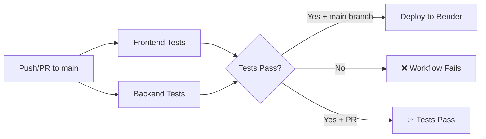

# CI/CD Setup Complete ✅

Your GitHub Actions CI/CD pipeline has been successfully configured!

## What Was Created

Created [`.github/workflows/ci.yml`](file:///Users/sagardhal/Desktop/Practice/play-with-friends-stream/.github/workflows/ci.yml) with:
- **Frontend Tests**: Runs `npm test` with Node.js 20
- **Backend Tests**: Runs `make test` with Python 3.13 and uv
- **Render Deployment**: Triggers deployment when tests pass on main branch

## Workflow Triggers

The workflow will run on:
- ✅ Push to `main` branch
- ✅ Pull requests to `main` branch
- ✅ Manual workflow dispatch

## Next Steps to Complete Setup

### 1. Create Render Deploy Hook

To enable automatic deployments, you need to create a Deploy Hook in Render:

1. Go to [Render Dashboard](https://dashboard.render.com/)
2. Select your service: **play-with-friends-stream**
3. Navigate to **Settings** → **Deploy Hook**
4. Click **Create Deploy Hook**
5. Copy the generated URL

### 2. Add GitHub Secret

Add the deploy hook URL as a GitHub secret:

1. Go to your GitHub repository: https://github.com/sagardampba2022w/play-with-friends-stream
2. Navigate to **Settings** → **Secrets and variables** → **Actions**
3. Click **New repository secret**
4. Name: `RENDER_DEPLOY_HOOK_URL`
5. Value: Paste the deploy hook URL from Render
6. Click **Add secret**

### 3. Test the Workflow

Once the secret is added:

1. **Test on PR**: Create a new branch, make a change, and open a PR to `main`
   - Frontend and backend tests will run
   - Deployment will NOT trigger (PRs don't deploy)

2. **Test deployment**: Merge the PR to `main`
   - Tests will run
   - If tests pass, deployment to Render will trigger automatically

## Workflow Jobs Overview

## Monitoring

- **GitHub Actions**: Check the Actions tab in your repository to see workflow runs
- **Render**: Check your Render dashboard to monitor deployment status

## Troubleshooting

If deployment doesn't trigger:
- Verify `RENDER_DEPLOY_HOOK_URL` secret is set correctly in GitHub
- Check that push is to the `main` branch (not a PR)
- Review workflow logs in GitHub Actions tab
